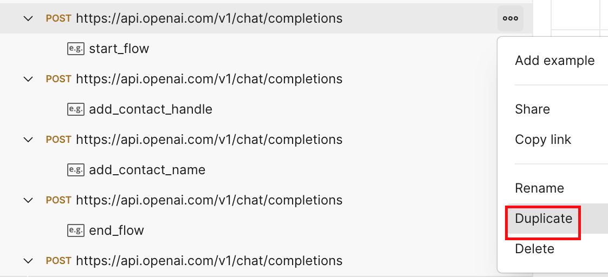
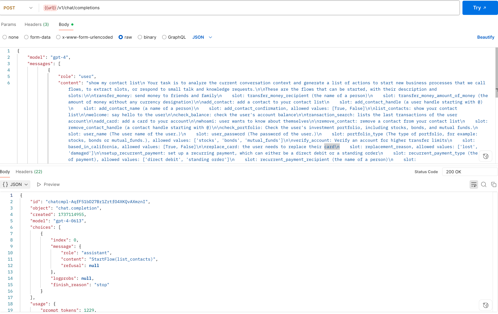
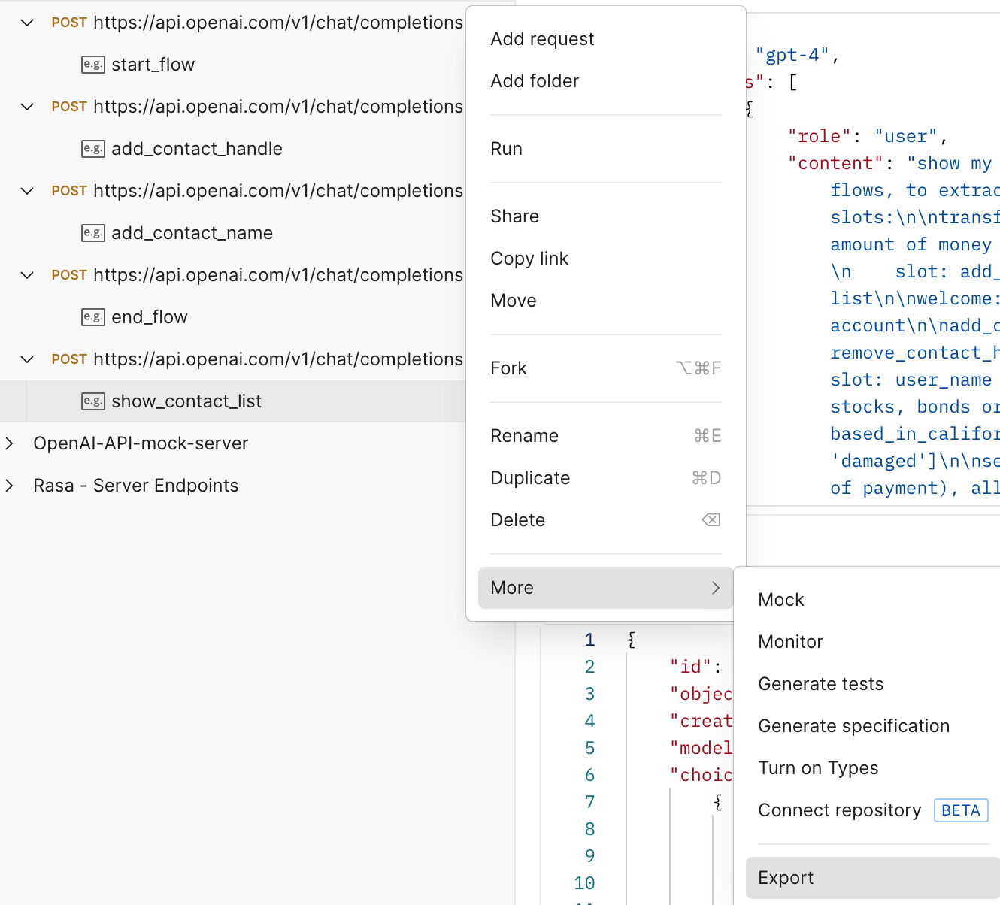

# Mock LLM server for deterministic E2E tests
Mock `OpenAI` API server, containing `v1/chat/completions` endpoints, that return pre-configured responses.

## Brief technical details
### Server setup
[`llm_mock_server.py`](./llm_mock_server.py) script sets up a `FastAPI` server, with endpoints created by parsing `Postman` collection [`collection.json`](./collection.json),
which contains endpoints with sample requests and corresponding pre-configured responses. The server can be started as a Docker container, listening on port 8080, via [`docker-compose.yml`](./docker-compose.yml).

### Requests routing
Requests (for example from E2E tests) are routed to relevant endpoint by matching against conversation history and last user message defined in endpoints' sample requests.

## Current capabilities and how to add new tests
### Current capabilities
Currently, the server can respond with following mock commands (based on old-DSL, as currently it has been used with `SingleStepLLMCommandGenerator`):
1. `StartFlow(add_contact)`
2. `SetSlot(add_contact_handle, @barts)`
3. `SetSlot(add_contact_name, Bart)`
4. `SetSlot(add_contact_confirmation, True)`
5. `StartFlow(list_contacts)`

### How to add further requests and responses
This can be done by updating the `Postman` collection [`collection.json`](./collection.json). Easiest way to do this is:
1. Prerequisite: If not done already, then install `Postman` locally (on `mac`: `brew install --cask postman`).
2. Import Collection into `Postman` (refer to Postman [docs](https://learning.postman.com/docs/getting-started/importing-and-exporting/importing-data/) for details), for viewing and editing.
3. Duplicate the endpoint(s) that is similar to your required request and response.

4. Edit the request and response bodies of the endpoint(s) accordingly.

5. Save the updated collection, and Export it to this repo directory, and commit + push changes.

